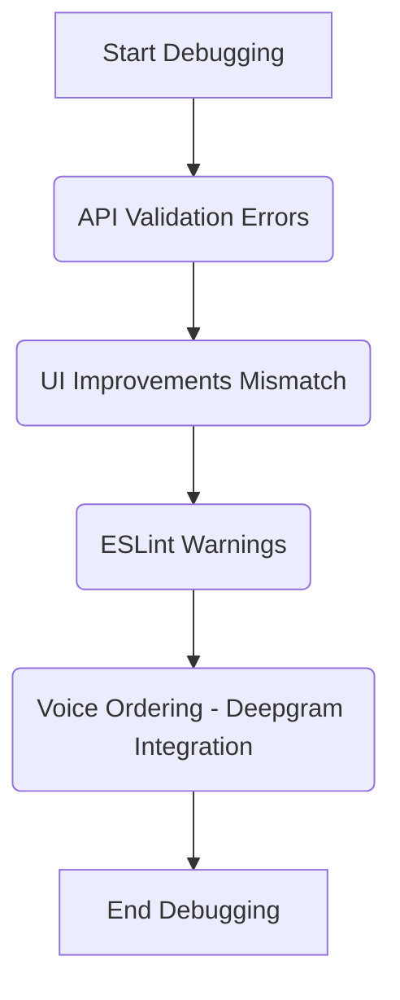

# Plate Order System - Debugging Plan

This plan outlines the steps to address the remaining issues in the Plate Order System project based on the recap provided and initial analysis.

## Confirmed Baseline

*   The project uses `restaurant.db` as the primary database, configured via `.env`.
*   The `database_fix.py` script correctly reflects the database standardization process.
*   Key backend API (`src/app/api/`) and frontend component (`frontend/src/components/`) file locations match the recap.
*   The project has fully switched to using Deepgram for voice ordering (OpenAI removed), and the API key is configured.

## Remaining Issues & Debugging Steps

1.  **API Validation Errors (422 Unprocessable Entity):**
    *   **Goal:** Identify and fix the root cause of validation errors on specific API endpoints (e.g., `/api/orders/recent`).
    *   **Approach:** Examine Pydantic models, analyze data flow, check endpoint logic, and potentially add logging.

2.  **UI Improvements Mismatch:**
    *   **Goal:** Ensure the frontend UI matches the intended state (zoom/pan/background in `TableManagement.tsx`, animations).
    *   **Approach:** Review `TableManagement.tsx` code, inspect relevant CSS, and potentially run the frontend locally for visual inspection.

3.  **ESLint Warnings:**
    *   **Goal:** Resolve JavaScript/TypeScript linting issues in the frontend codebase.
    *   **Approach:** Run ESLint across `frontend/src`, analyze warnings, and apply necessary code changes.

4.  **Voice Ordering (Deepgram Integration):**
    *   **Goal:** Ensure Deepgram is fully integrated and active, removing any demo mode logic.
    *   **Approach:** Locate voice ordering code, confirm Deepgram API usage, remove any fallback/demo logic, verify `DEEPGRAM_API_KEY` usage.

## Proposed Workflow

## Next Step

Proceed with debugging the **API Validation Errors**.