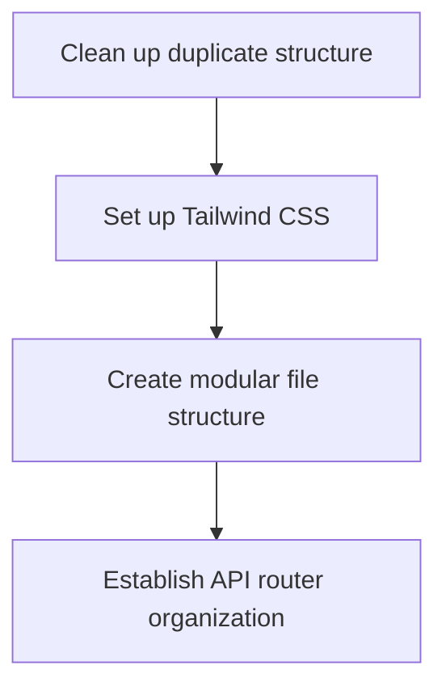
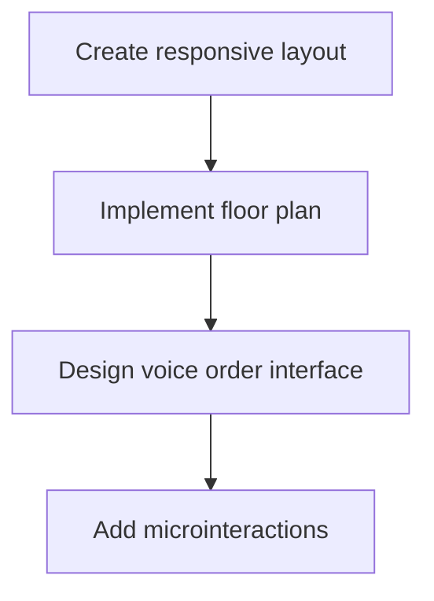
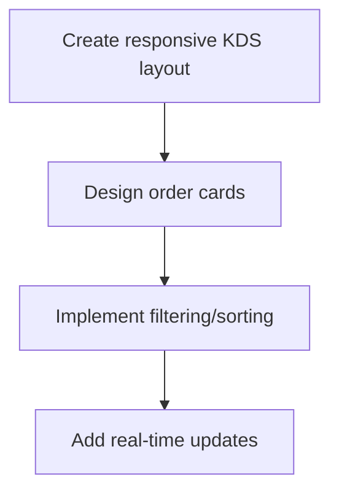
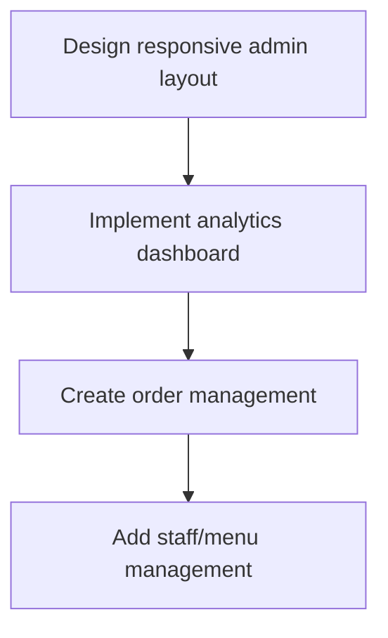
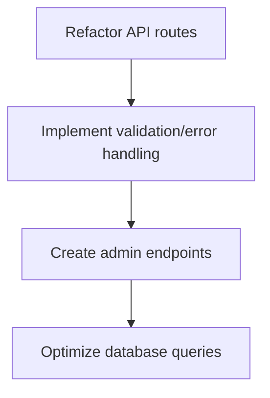
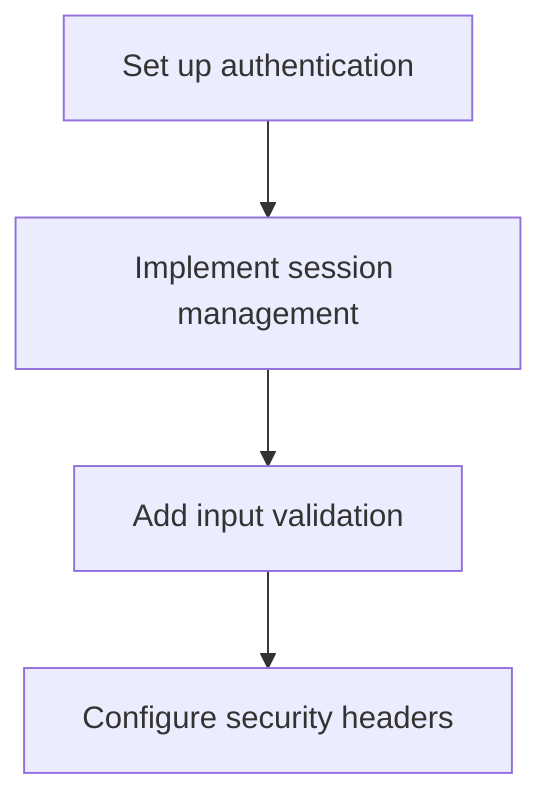
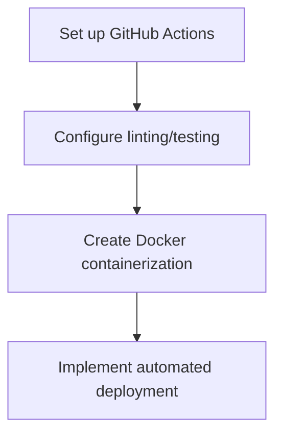
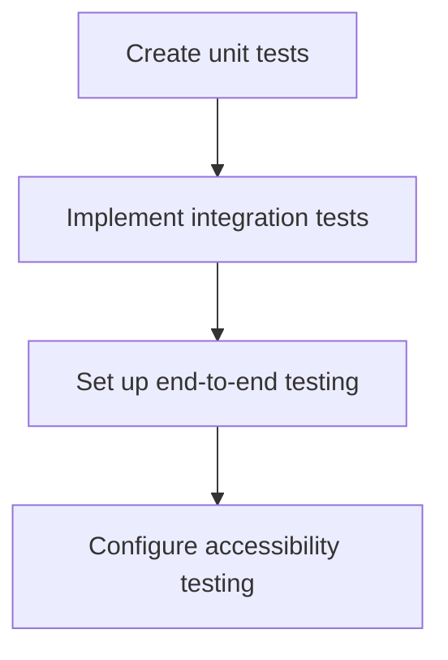

# Comprehensive Modular Plan for Plate Order System Overhaul

## Overview

This plan breaks down the project into distinct, independent modules that can be implemented separately to manage costs better. Each module focuses on a specific aspect of the system and can be completed as a standalone unit.

## Module 1: Project Structure and Foundation

**Objective**: Reorganize the project structure for better modularity and prepare the foundation for the overhaul.

**Tasks**:
1. Clean up the duplicate directory structure
2. Set up Tailwind CSS with a custom configuration
3. Create a modular file structure for frontend components
4. Establish API router organization

**Files to Create/Modify**:
- `tailwind.config.js` - Custom Tailwind configuration
- `app/static/css/tailwind.css` - Base Tailwind CSS file
- `app/static/js/components/` - Directory for reusable UI components
- `app/api/router.py` - Central API router configuration

**Complexity**: Low to Medium

**Dependencies**: None (this is the foundation)

## Module 2: Server View UI/UX for iPad

**Objective**: Redesign the server view for optimal iPad use with a fixed-width layout.

**Tasks**:
1. Create responsive layout with 1024px fixed width
2. Implement floor plan visualization with table management
3. Design voice order recording interface
4. Add microinteractions and state transitions

**Files to Create/Modify**:
- `app/templates/server-view.html` - New template for server view
- `app/static/css/server-view.css` - Styles for server view
- `app/static/js/components/floor-plan.js` - Floor plan component
- `app/static/js/components/voice-recorder.js` - Voice recording component

**Complexity**: Medium

**Dependencies**: Module 1

## Module 3: Kitchen View UI/UX for iPad

**Objective**: Redesign the kitchen display system (KDS) for optimal iPad use.

**Tasks**:
1. Create responsive KDS layout with 1024px fixed width
2. Design order cards with status indicators
3. Implement order filtering and sorting
4. Add real-time updates via WebSockets

**Files to Create/Modify**:
- `app/templates/kitchen-view.html` - New template for kitchen view
- `app/static/css/kitchen-view.css` - Styles for kitchen view
- `app/static/js/components/order-card.js` - Order card component
- `app/static/js/components/order-filters.js` - Order filtering component

**Complexity**: Medium

**Dependencies**: Module 1

## Module 4: Admin Dashboard for Computer Access

**Objective**: Create a full-width responsive admin dashboard inspired by restaurant POS systems.

**Tasks**:
1. Design responsive admin layout for larger screens
2. Implement analytics dashboard with charts
3. Create order history and management interface
4. Add staff and menu management components

**Files to Create/Modify**:
- `app/templates/admin-view.html` - New template for admin view
- `app/static/css/admin-view.css` - Styles for admin view
- `app/static/js/components/analytics-dashboard.js` - Analytics component
- `app/static/js/components/order-management.js` - Order management component
- `app/static/js/components/staff-management.js` - Staff management component
- `app/static/js/components/menu-management.js` - Menu management component

**Complexity**: High

**Dependencies**: Module 1

## Module 5: Backend API Improvements

**Objective**: Enhance the backend API for better modularity, performance, and feature support.

**Tasks**:
1. Refactor API routes using FastAPI's APIRouter
2. Implement proper data validation and error handling
3. Create endpoints for new admin features
4. Optimize database queries and models

**Files to Create/Modify**:
- `app/api/admin.py` - Admin-specific API endpoints
- `app/api/analytics.py` - Analytics API endpoints
- `app/models/staff.py` - Staff model for authentication
- `app/models/menu.py` - Menu model for menu management

**Complexity**: Medium to High

**Dependencies**: Module 1

## Module 6: Security Enhancements

**Objective**: Implement enterprise-grade security features.

**Tasks**:
1. Set up authentication with JWT and role-based access control
2. Implement secure session management
3. Add input validation and sanitization
4. Configure security headers and HTTPS

**Files to Create/Modify**:
- `app/security/auth.py` - Authentication and authorization
- `app/security/middleware.py` - Security middleware
- `app/security/validators.py` - Input validation utilities
- `app/api/dependencies.py` - Security dependencies for API routes

**Complexity**: High

**Dependencies**: Modules 1 and 5

## Module 7: CI/CD Pipeline Setup

**Objective**: Create an automated CI/CD pipeline for testing, building, and deployment.

**Tasks**:
1. Set up GitHub Actions workflow
2. Configure linting and testing automation
3. Create Docker containerization
4. Implement automated deployment

**Files to Create/Modify**:
- `.github/workflows/ci.yml` - CI workflow configuration
- `.github/workflows/cd.yml` - CD workflow configuration
- `Dockerfile` - Docker configuration
- `docker-compose.yml` - Docker Compose configuration

**Complexity**: Medium to High

**Dependencies**: All previous modules

## Module 8: Testing and Quality Assurance

**Objective**: Implement comprehensive testing and quality assurance.

**Tasks**:
1. Create unit tests for backend components
2. Implement integration tests for API endpoints
3. Set up end-to-end testing for UI
4. Configure accessibility testing

**Files to Create/Modify**:
- `tests/unit/` - Unit test directory
- `tests/integration/` - Integration test directory
- `tests/e2e/` - End-to-end test directory
- `tests/accessibility/` - Accessibility test directory

**Complexity**: Medium

**Dependencies**: All previous modules

## Implementation Strategy

To implement this plan in a cost-effective manner:

1. **Start with Foundation**: Begin with Module 1 to establish the project structure.

2. **Prioritize User-Facing Features**: Implement Modules 2 and 3 next to improve the core user experience.

3. **Add Administrative Features**: Implement Module 4 to provide management capabilities.

4. **Enhance Backend and Security**: Implement Modules 5 and 6 to improve the system's robustness.

5. **Finalize with Automation**: Complete Modules 7 and 8 to ensure quality and ease of deployment.

Each module can be implemented independently, allowing you to spread the cost over time and focus on the most critical aspects first.

## Cost Management Approach

To further manage costs during implementation:

1. **Implement One Module at a Time**: Complete each module fully before moving to the next.

2. **Test Thoroughly**: Ensure each module works correctly before proceeding.

3. **Use Local Development**: Minimize API calls during development by using local testing.

4. **Batch Updates**: Group related changes to minimize the number of API interactions.

5. **Leverage Caching**: Implement caching strategies to reduce redundant operations.